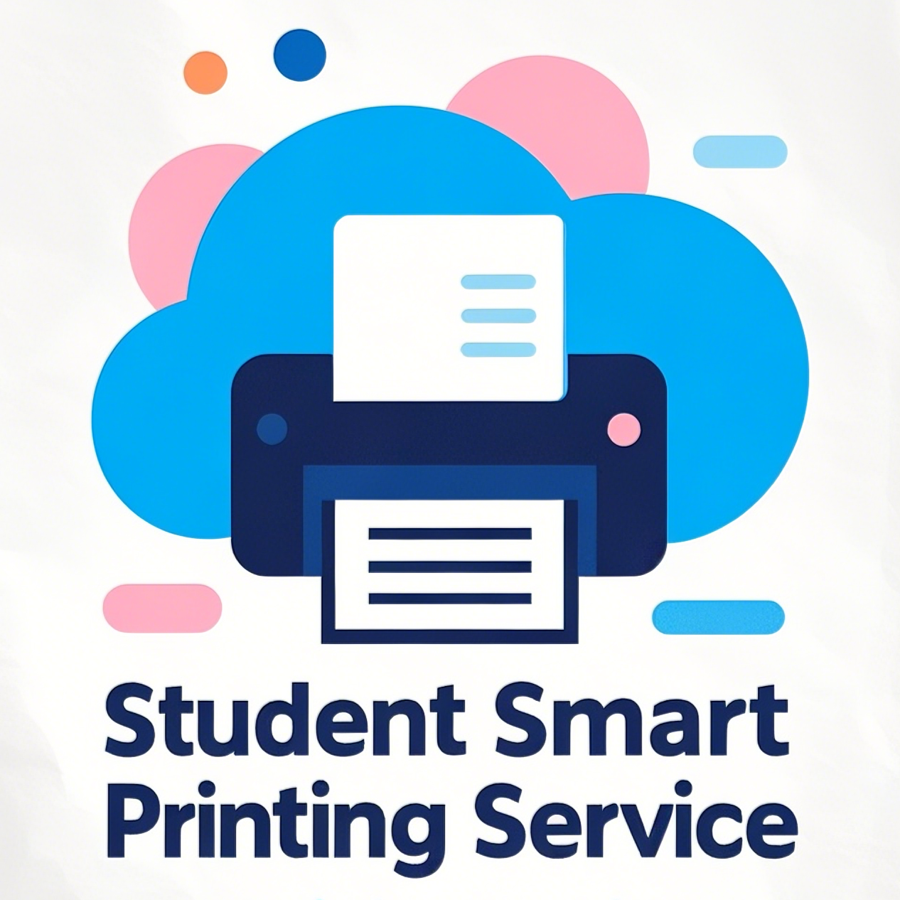
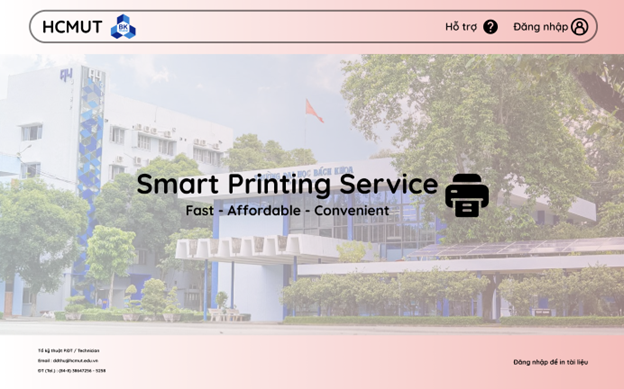

<!-- PROJECT LOGO -->
<div align="center">
  <a href="https://github.com/Software-Engineer-Team/Urban-Waste-Collection-v2">
    
  </a>

<h3 align="center">Student-Smart-Printing-Service</h3>

  <p align="center">
    <p style="text-align:center;"> <span style="background: linear-gradient(to right, #8B0000, #4B0082, #00008B); -webkit-background-clip: text; color: transparent;">Student Smart Printing Service</span> là dự án nhằm xây dựng một hệ thống in ấn thông minh có thể truy cập từ xa dành cho sinh viên trường Đại học Bách khoa TP.HCM</p>
    <br />
    <a href="Capstone_Project_Autumn_2023.pdf" target="_blank"><strong>Explore the docs »</strong></a>
    <br />
    <br />
    <a href="https://urban-waste-collection-v2.netlify.app/" target="_blank">View Demo</a>
    ·
    <a href="https://github.com/Software-Engineer-Team/Urban-Waste-Collection-v2/issues" target="_blank">Report Bug</a>
    ·
    <a href="https://github.com/Software-Engineer-Team/Urban-Waste-Collection-v2/issues/issues" target="_blank">Request Feature</a>
  </p>
</div>

<!-- TABLE OF CONTENTS -->
<details>
  <summary>Table of Contents</summary>
  <ol>
    <li>
      <a href="#about-the-project">About The Project</a>
      <ul>
        <li><a href="#built-with">Built With</a></li>
      </ul>
    </li>
    <li>
      <a href="#getting-started">Getting Started</a>
      <ul>
        <li><a href="#prerequisites">Prerequisites</a></li>
        <li><a href="#%F0%9F%93%A6-installation">Installation</a></li>
      </ul>
    </li>
    <li><a href="#%F0%9F%9A%80-usage">Usage</a></li>
    <li><a href="#%E2%9A%99-our-demo-site">Demo</a></li>
  </ol>
</details>

<!-- ABOUT THE PROJECT -->

## About The Project



**🌟Các tính năng cho sinh viên:**

- Sinh viên có thể xem thông tin tài khoản in, theo dõi số dư trang in, lịch sử in và các tùy chọn thanh toán trong một giao diện dễ sử dụng.
- Sinh viên có thể tải tệp lên hệ thống từ máy tính hoặc điện thoại với các định dạng tệp được hỗ trợ như PDF, DOCX, PPT và các định dạng khác.
- Sinh viên có thể chọn máy in phù hợp từ danh sách các máy in khả dụng, được phân loại theo vị trí và trạng thái hoạt động.
- Sinh viên có thể cấu hình các tùy chọn in như khổ giấy (A4/A3), số lượng bản in và in một mặt hoặc hai mặt theo nhu cầu cá nhân.
- Sinh viên có thể mua thêm trang in thông qua hệ thống thanh toán trực tuyến BKPay khi hết hạn mức in.
- Hệ thống cung cấp thông báo trạng thái in ngay lập tức, giúp sinh viên biết khi nào tài liệu đã được in xong hoặc nếu có lỗi xảy ra.
- Sinh viên có thể xem lại lịch sử in của mình, bao gồm các chi tiết như số lượng trang đã in và máy in đã sử dụng.
- Sinh viên có thể quản lý các tài liệu đã tải lên, chỉnh sửa hoặc xóa tài liệu trước khi in.
- Hệ thống tự động gửi thông báo khi sinh viên sắp hết trang in, giúp sinh viên dễ dàng quản lý tài khoản của mình.
- Sinh viên có thể yêu cầu hỗ trợ kỹ thuật qua hệ thống nếu gặp sự cố trong quá trình in.


**🌟Các tính năng cho người quản lý (SPSO):**

- SPSO có thể quản lý toàn bộ hệ thống máy in, thêm, bật/tắt hoặc vô hiệu hóa các máy in khi cần thiết.
- SPSO có thể cấu hình hệ thống, bao gồm việc thiết lập các định dạng tệp được phép, số trang mặc định cho mỗi sinh viên và thời gian làm mới hạn mức in mỗi học kỳ.
- SPSO có thể theo dõi và kiểm tra nhật ký in ấn của sinh viên, bao gồm các thông tin về sinh viên, máy in, thời gian, và số lượng trang đã in.
- SPSO có thể truy cập các báo cáo sử dụng hàng tháng hoặc hàng năm về hoạt động in ấn để đánh giá hiệu quả và tối ưu hóa tài nguyên.
- SPSO có thể điều chỉnh hạn mức in hoặc cấp thêm trang in miễn phí cho sinh viên trong các trường hợp đặc biệt.
- SPSO nhận thông báo ngay lập tức khi máy in gặp sự cố như hết mực, kẹt giấy hoặc không hoạt động, để xử lý kịp thời.
- SPSO có thể gửi thông báo hoặc cảnh báo cho sinh viên qua hệ thống, giúp thông báo các thay đổi hoặc sự cố trong quá trình in.
- SPSO quản lý việc đăng nhập và bảo mật hệ thống qua HCMUT_SSO, đảm bảo chỉ những người có quyền truy cập mới có thể sử dụng hệ thống.
- SPSO có thể tự động tạo báo cáo về hoạt động in ấn, giúp việc kiểm toán và tối ưu hóa hệ thống dễ dàng hơn.
- SPSO có thể tối ưu hóa việc sử dụng tài nguyên in trong trường học, phân bổ máy in hợp lý và giảm thiểu tình trạng quá tải hoặc máy in không sử dụng.


### Built With

- [![React][React.js]][React-url]
- [](#)
- [](#)
- [![Tailwind_CSS][Tailwind-CSS]][Tailwind-CSS-url]
- [![shadcn/ui][shadcn-ui]][shadcn-ui-url] 
- [![draw.io][drawio]][drawio-url]

<!-- GETTING STARTED -->

## Getting Started

Sau đây là hướng dẫn cách thiết lập dự án trên thiết bị của bạn. Để có thể chạy dự án trên máy cục bộ của bạn hãy làm theo các bước đơn giản sau đây

### 💥Prerequisites

Cần cài đặt NodeJS và NPM sẵn trên hệ thống


### 📦 Installation

1. Sao chép dự án
    
    ```shell
    git clone https://github.com/Benhidangiu1408/BTL-CNPM.git
    ```
    
2. Cài đặt các dependency, NPM packages của dự án
    
    ```js
    npm install
    ```
    
3. Khởi động ứng dụng
    
    ```js
    npm run dev
    ```
    


<!-- USAGE EXAMPLES -->

## 🚀 Usage

> :warning: **Đang mở rộng**

## Team members

| No. | Name             | Student ID | Email                           | Contact                                                                                                                                                                                                                     |
| :-: | ---------------- | :--------: | ------------------------------- | --------------------------------------------------------------------------------------------------------------------------------------------------------------------------------------------------------------------------- |
|  1  | Trần Lương Yến Nhi    |  2252586   |  nhi.tranluongyen@hcmut.edu.vn           | [][fb1] [][git1] |
|  2  |  Trần Hữu Phước |  2153717   | phuoc.tranhphuoc1218@hcmut.edu.vn    | [][fb2] [][git2] |
|  3  | Trần Quang Thiên |  2252768   |  thien.tran0502@hcmut.edu.vn  | [][fb3] [][git3] |
|  4  | Trần Ngọc Khánh Huy  |  2252265   | huy.tranrosenberg@hcmut.edu.vn    | [][fb4] [][git4] |
|  5  | Trần Trung Kiên    |  2252397   | kien.trantrung@hcmut.edu.vn | [][fb5] [][git5] |

### ⚙ Our demo site

- Tại đây, bạn có thể dễ dàng truy cập Ứng dụng web Student Smart Printing Service của chúng tôi với bản xem trước trực tiếp (live preview)

> :warning: 🎯 **Đang mở rộng**

<h1 align="center">🌟 Good Luck and Cheers! 🌟</h1>

[product-screenshot]: images/uwc-product.png
[React.js]: https://img.shields.io/badge/React-%2320232a.svg?logo=react&logoColor=%2361DAFB
[React-url]: https://reactjs.org/
[Spring-Boot]: https://img.shields.io/badge/Spring%20Boot-2.7.4-green.svg?style=for-the-badge&logo=spring
[styled-components]: https://img.shields.io/badge/styled--components-%23DB7093.svg?style=for-the-badge&logo=styled-components&logoColor=white
[styled-components-url]: https://styled-components.com/
[drawio]: https://img.shields.io/badge/draw.io-%23000000.svg?style=for-the-badge&logo=draw-dot-io&logoColor=white
[drawio-url]: https://www.draw.io/
[Spring-Boot-url]: https://spring.io/projects/spring-boot
[Tailwind-CSS]: https://img.shields.io/badge/Tailwind%20CSS-%2338B2AC.svg?logo=tailwind-css&logoColor=white
[Tailwind-CSS-url]: https://tailwindcss.com/
[shadcn-ui]: https://img.shields.io/badge/shadcn%2Fui-000?logo=shadcnui&logoColor=fff
[shadcn-ui-url]: https://ui.shadcn.com/


[fb1]: https://www.facebook.com/suahotga1408/
[fb2]: https://www.facebook.com/tranhuu.phuoc.9231/
[fb3]: https://www.facebook.com/Branzukai/
[fb4]: https://www.facebook.com/lev1anth/
[fb5]: https://www.facebook.com/profile.php?id=100022140130351&mibextid=ZbWKwL
[git1]: https://github.com/Benhidangiu1408
[git2]: https://github.com/huuphuoc1218
[git3]: https://github.com/thientq52
[git4]: https://github.com/Rosenberg2002
[git5]: https://github.com/kienntheprfs
